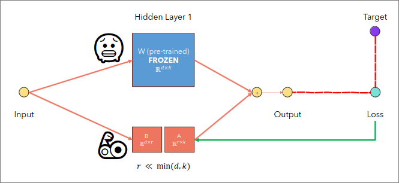

# LoRA - Low-Rank Adaptation of LLM
## Overview
**Problems with Full Fine-Tuning**  
- We must train the full network, which is computationally expensive for the average user when dealing with LLMs like GPT.
- Storage requirements for the checkpoints are expensive, as we need to save the entire model on the disk for each checkpoint. If we also save the optimizer state which we usually do, then the situation gets worse.
- If we have multiple fine tuned models, we need to reload all the weights of the model every time we want to switch between them, which can be expensive and slow.

**Introduction to LoRA**

**Why does it work?**  
- A neural network contains many dense layers which perform matrix multiplication. The weight matrices in these layers typically have full rank.
- But, when the pre-trained model is adapting to a specific task, it shows that pre-trained model LLMs contains many parameters that convey the same information as others(so they can be obtained by a combination of the other weights);
- This means we can get rid of them without decreasing the performance of the model.
- This kind of matrices are called rank-deficient(they do not have full-rank)
- For a pre-trained weight matrix $W_0\in \mathbb{R}^{d\times k}$, we constraint its update by representing the latter with a low-rank decomposition as
  $$W_0 + \Delta W = W_0 + BA $$ 
  - where, $B \in \mathbb{R}^{d\times r}, A \in \mathbb{R}^{r\times k}$; $ rank(r) << min(d,k)$
- During training, $W_0$ is frozen and does not receive gradient updates, while $A$ and $B$ contain trainable parameters.
- For $h = W_0x$, where $x$ is the input, our modified forward pass yields
  $$ h = W_0 x + \Delta Wx = W_0x + BAx$$

## Benefits
- Less parameters to train and store.
  - if $d=5000$, and $k = 5000$;
    - No. of parameters = $d \times k = 25,000,000$
  - Now, after LoRA,
    - r = 5, we get; No. of parameters = $(d\times r) + (r\times k) = 50,000$
- Less parameters = Less storage requirements
- Faster back-propagation, as we do not need to evaluate the gradient for most of the parameters.

For more check out [this](https://github.com/hkproj/pytorch-lora/blob/main/Slides.pdf)

Happy Coding!!