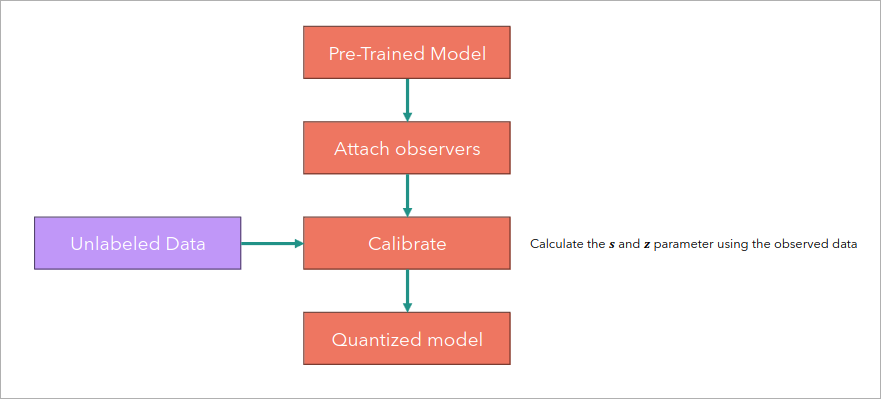
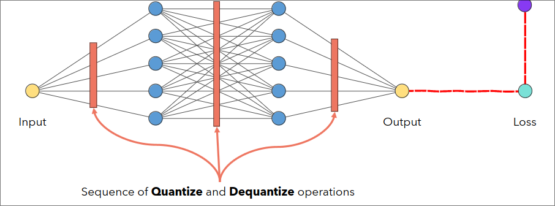

# Quantization
## Overview
- It is a model compression technique.
- Here, we converts the weights and activations within an LLM from a high precision data representation(float 32) to a lower precision data representation(int8).
- That is from a data type that can hold more information to one that hold less information.
- For eg. 32 bit floating point to 8 bit integer.

`Note:`  
- Full precision: using 32-bit or even higher precision floating point numbers to store numerical values.
- Half precision: representing numerical values with less detail or accuracy compared to full precision.
  
## Techniques
### 1. Asymmetric Quantization
- It allows to map series of floating point numbers in the range [$\beta$, $\alpha$] into another in the range $[0, 2^n-1]$
- Asymmetric means numbers are not evenly distributed.
- Formula for quantization is
  $$x_q = clamp(round(\frac{x_f}{s})+z;0;2^n-1)$$

  - Where, $x_q$ = quantized value
  - $s$ = scaling factor; $s=\frac{\alpha-\beta} {2^n-1}$; $\alpha=$ Maximum value and $\beta=$ Minimum value
  - $z$ = Zero point; $z=round(-1(\frac{\beta}{s}))$
- Formula for de-quantization is
  $$x_f = s(x_q - z) $$

### 2. Symmetric Quantization
- It allows to map series of floating point numbers in the range [$-\alpha$, $\alpha$] into another in the range $[-(2^{n-1} -1), (2^{n-1}-1)]$
- Formula for quantization is
  $$x_q = clamp(round(\frac{x_f}{s});-(2^{n-1} -1);(2^{n-1} -1))$$

  - Where, $x_q$ = quantized value
  - $s$ = scaling factor; $s=\frac{\left| \alpha \right|} {2^{n-1} -1}$; $\alpha=$ Maximum value and $\beta=$ Minimum value

- Formula for de-quantization is
  $$x_f = s(x_q) $$

## Quantization Range: how to choose $[\alpha, \beta]$
### 1. Min-Max
- To cover the whole range of values, we can set
  - $\alpha = max(V)$
  - $\beta = min(V)$, where V are the values.
- But, there is a problem. This method is sensitive to outliers, which means it will increase the quantization error.

**Better Approach**  
- `Percentile:` Set the range to the percentile of distribution of V, to reduce sensitivity to outliers.

#### Other Approaches are
### 2. Means-Squared Error
- Choose $[\alpha, \beta]$ such that the MSE between the original values and the de-quantized values is minimized.
- Usually solved using grid search.

### 3. Cross entropy
- Used when the values in the tensor being quantized are not equally important.

## Modes of Quantization
### 1. Post Training Quantization

- This method is easy to implement but reduces the accuracy of the model.

### 2. Quantization Aware Training
- We insert some fake modules in the computational graph of the model to simulate the effect of the quantization during training.
- This way, the loss function gets used to update weights that constantly suffer from the effect of quantization, and it is usually leads to more robust model.

More detailed notes is available [here](https://github.com/hkproj/quantization-notes/blob/main/Slides.pdf)